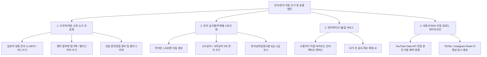

# 📚 상형한자 숏폼 자동 제작 파이프라인 - 개발 성공 방법론 & 확장 로드맵

---

## 🌟 1. 성공적으로 제작하게 된 핵심 기술 및 방법론

이번 프로젝트는 **수학적 렌더링 엔진(Manim) + 벡터 폰트 분해(AnimCJK/KanjiVG) + 실사 그래픽 마스킹(OpenCV) + AI 듀얼 신경망 음성(Edge-TTS) + FFmpeg 멀티트랙 믹싱**을 결합하여, 사람이 직접 편집하지 않아도 상용 쇼츠 퀄리티의 영상을 100% 전자동으로 대량 생산할 수 있는 체계를 구축했습니다.

### ① 1인칭 POV 실사 손 & 붓글씨 동기화 (서브픽셀 정밀도)
- **문제**: 정적인 컴퓨터 폰트 애니메이션은 몰입감이 떨어짐.
- **해결**: 전통 화선지 배경(`assets/hanji_texture.png`) 위에서 1인칭 실사 손-붓 이미지(`assets/hand_brush_clean.png`)의 붓끝(Tip) 접촉점 좌표를 서브픽셀 단위로 계산하여, 글자가 쓰이는 선단부와 붓끝이 1:1로 일치하며 따라가는 유기적인 애니메이션 구현.

### ② 깜빡임 없는 안전 경로 누적 마스킹 (v4 Corridor Engine)
- **문제**: 갈고리(Hook)나 급격한 꺾임 획에서 전방 마스킹 절단면이 기존에 그린 세로 기둥 획을 가려 깜빡임 발생.
- **해결**: 과거 궤적을 훼손하지 않는 **누적 복도(Cumulative Corridor)** 마스킹 기법을 개발하여, 아무리 복잡한 24획 이상의 한자도 매끄럽게 완성되도록 해결.

### ③ 획순 음성 생략 및 실사 ASMR 마찰음 & BGM 믹싱
- **문제**: "첫 번째 획!", "두 번째 획!" 등 기계적인 카운팅 음성이 붓글씨의 예술적 감상을 방해.
- **해결**: 카운팅 음성을 과감히 생략하고, 획이 그어지는 순간(7.80s ~ 1.60s 간격)과 1:1로 화선지 결 마찰 ASMR SFX(`brush_stroke.wav`) 및 감성적인 동양풍 BGM을 믹싱하여 영상 몰입도 극대화.

### ④ 오픈 벡터 DB 폴백 (AnimCJK + KanjiVG 결합)
- 한국/번체 한자 데이터셋에 누락된 특수 한자(`鵝`, `穀` 등)를 일본/간체 및 **KanjiVG(109x109 획 데이터)**에서 자동으로 탐색하고 1024x1024 좌표계로 자동 스케일링/변환하는 강력한 자가 치유(Fallback) 파서 구축.

---

## 🚀 2. 현재 코드를 응용하여 확장할 수 있는 영역 (확장 로드맵)

현재 구축된 엔진은 매우 모듈화되어 있어 다음과 같은 다양한 교육 및 상업적 콘텐츠로 즉시 무한 확장이 가능합니다.

### 1) 일본어 한자(상용한자 2,136자) & 가나 숏폼 확장
- KanjiVG는 일본 상용한자 2,136자의 모든 획순 데이터를 100% 보유하고 있습니다.
- 음성 성우만 일본어 신경망 성우(`ja-JP-NanamiNeural`)로 변경하면 **일본어 한자 쓰기 쇼츠 채널**로 즉시 확장 가능합니다.

### 2) 고사성어 및 사자성어(4자 연속 쓰기) 롱폼/쇼츠
- 1글자 숏폼을 넘어, 4개의 한자가 화면에 순서대로 쓰이며 유래와 교훈을 설명하는 **"하루 1분 사자성어"** 롱폼/쇼츠 비디오 자동 생성.

### 3) 천자문(1,000자) 및 한국 한자 급수별 마스터 시리즈
- 한자능력검정시험 8급(50자), 7급(150자), 6급(300자) 등 **급수별 완벽 대비 플레이리스트** 자동 빌드.

### 4) SNS 완전 자동 업로드 파이프라인 (No-Human)
- `batch_runner.py` 완료 후 YouTube Data API v3 및 TikTok API를 연동하여 **매일 정해진 시간(예: 오전 8시, 오후 6시)에 자동으로 제목, 해시태그, 썸네일과 함께 업로드되는 완전 무인 채널 운영**.
